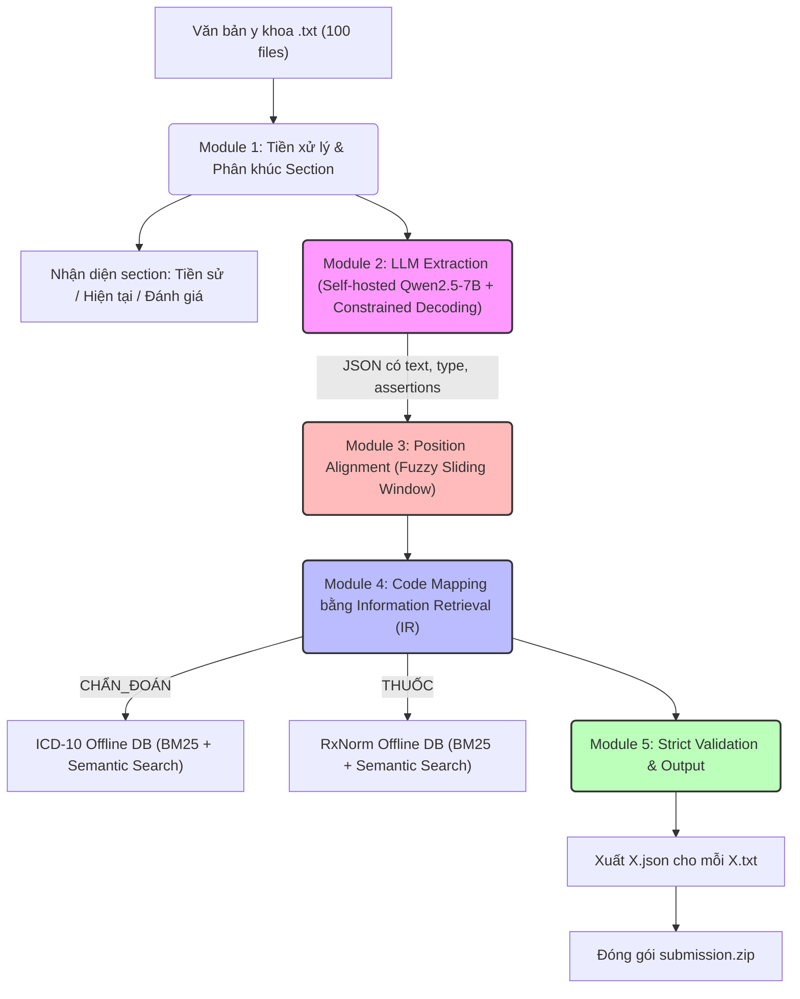
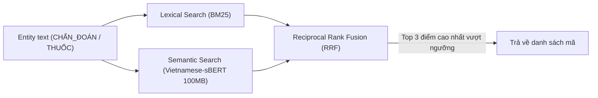

# 📘 Tài Liệu Hướng Dẫn Giải Pháp & Thiết Kế Kiến Trúc (v4 - Đã tối ưu cho LLM < 9B)
## Hệ thống AI Trích xuất Khái niệm Y khoa & Suy luận Ontology

---

## 1. Sơ đồ Kiến trúc Tổng thể (Tuân thủ Offline & LLM < 9B)



---

## 2. Quy ước Position: `[start, end)` — End Exclusive

Đề bài ghi: *"vị trí tính từ 0 đến n-1"*. Phân tích ví dụ mẫu để xác nhận convention:

| Entity | position | Độ dài ký tự | Kiểm chứng |
|--------|----------|-------------|------------|
| `"ho đờm xanh"` | `[36, 47]` | 11 ký tự | `47 - 36 = 11` ✅ |
| `"tức ngực"` | `[49, 57]` | 8 ký tự | `57 - 49 = 8` ✅ |
| `"ợ hơi"` | `[74, 79]` | 5 ký tự | `79 - 74 = 5` ✅ |
| `"WBC"` | `[287, 290]` | 3 ký tự | `290 - 287 = 3` ✅ |

**Kết luận**: `position = [start, end)` theo chuẩn Python slice: `original_text[start:end]` trả về đúng entity text.

---

## 3. Cấu trúc JSON Đầu ra & Bảng Ràng buộc Logic

### 3.1. Format JSON chuẩn

```json
[
  {
    "text": "cụm từ chính xác từ văn bản gốc",
    "position": [start, end],
    "type": "CHẨN_ĐOÁN",
    "assertions": ["isHistorical"],
    "candidates": ["K21.0", "K21.9"]
  }
]
```

### 3.2. Bảng ràng buộc logic bắt buộc (Strict Constraints)

| `type` | `assertions` được phép | `candidates` được phép | Chuẩn mã |
| :--- | :--- | :--- | :--- |
| `CHẨN_ĐOÁN` | `isNegated`, `isFamily`, `isHistorical` | **Bắt buộc điền mã ICD-10 nếu tìm được** | ICD-10 |
| `THUỐC` | `isNegated`, `isFamily`, `isHistorical` | **Bắt buộc điền mã RxNorm nếu tìm được** | RxNorm |
| `TRIỆU_CHỨNG` | `isNegated`, `isFamily`, `isHistorical` | **Bắt buộc `[]`** | — |
| `TÊN_XÉT_NGHIỆM` | **Bắt buộc `[]`** | **Bắt buộc `[]`** | — |
| `KẾT_QUẢ_XÉT_NGHIỆM` | **Bắt buộc `[]`** | **Bắt buộc `[]`** | — |

---

## 4. Module 1: Tiền xử lý & Nhận diện Section (Kháng lỗi chính tả)

**Mục tiêu:** Bảo toàn tuyệt đối tọa độ `position` của văn bản gốc (giúp tối đa hóa Text Score) và khoanh vùng các Section (Tiền sử, Hiện tại, Đánh giá) để hỗ trợ gán nhãn `isHistorical` (Tối đa hóa Assertions Score).
- **Kháng lỗi chính tả bằng Fuzzy Matching:** Sử dụng thuật toán Levenshtein (`thefuzz`) để nhận diện tiêu đề thay vì Regex cứng ngắc. Bác sĩ gõ sai "Tiển sử bệnh" thuật toán vẫn bắt được.
- **Tối ưu chống nhận diện nhầm (False Positives):**
  1. *Giới hạn độ dài:* Bỏ qua các dòng dài hơn 40 ký tự (vì tiêu đề thường rất ngắn).
  2. *Loại trừ liệt kê:* Bỏ qua các dòng bắt đầu bằng `-`, `+`, `*` để không bắt nhầm các câu liệt kê (VD: "- không có tiền sử bệnh").
  3. *Hard Override (Bẻ lái logic):* Nếu thuật toán chấm điểm "Tiền sử" cao, nhưng trong câu có chứa từ khóa "hiện tại" hoặc "diễn biến", hệ thống sẽ tự động ép đổi nhãn thành Bệnh sử hiện tại.

---

## 5. Module 2: LLM Extraction — Tối ưu cho Mô hình < 9B

### 4.1. Lựa chọn Mô hình & Kỹ thuật
- **Mô hình:** `Qwen/Qwen2.5-7B-Instruct` (Hỗ trợ tiếng Việt xuất sắc, vượt qua các benchmark 7B hiện tại) hoặc `PhoGPT-7.5B`.
- **Constrained Decoding:** Sử dụng `vLLM` kết hợp grammar/Regex (hoặc thư viện `Outlines`) để **ép** mô hình chỉ được phép sinh ra JSON hợp lệ. Hơn nữa, ràng buộc trường `text` bắt buộc phải là một chuỗi con (substring) có tồn tại trong đoạn văn bản input để triệt tiêu lỗi ảo giác text (giảm WER).

### 4.2. JSON Schema yêu cầu LLM trả về (Bỏ candidates cho LLM)
*Lưu ý: Không bắt mô hình < 9B dự đoán candidates để tránh ảo giác.*

```json
{
  "type": "object",
  "properties": {
    "concepts": {
      "type": "array",
      "items": {
        "type": "object",
        "properties": {
          "text": { "type": "string" },
          "type": { "type": "string", "enum": ["TRIỆU_CHỨNG", "TÊN_XÉT_NGHIỆM", "KẾT_QUẢ_XÉT_NGHIỆM", "CHẨN_ĐOÁN", "THUỐC"] },
          "assertions": {
            "type": "array",
            "items": { "type": "string", "enum": ["isNegated", "isFamily", "isHistorical"] }
          }
        },
        "required": ["text", "type", "assertions"]
      }
    }
  }
}
```

---

## 6. Module 3: Position Alignment — Thuật toán Khớp mờ Trượt

Do LLM đôi khi vẫn có thể sinh sai lệch nhỏ về text, thuật toán Fallback này sẽ giúp mapping lại đoạn text bị sai về vị trí chính xác nhất trong văn bản. (Giữ nguyên thuật toán Exact Match -> Normalized Match -> Fuzzy Sliding Window).

---

## 7. Module 4: Information Retrieval (IR) cho Code Mapping (Thay thế LLM Prediction)

Tuyệt đối không dùng API ngoài và LLM < 9B để sinh mã. Sử dụng Search Engine nội bộ trên Database Offline.

### 6.1. Xây dựng Offline Database
- **ICD-10:** Tải danh mục ICD-10 tiếng Việt chuẩn hóa thành file `icd10_offline.db`.
- **RxNorm:** Tải bản release UMLS/RxNorm mới nhất, trích xuất dữ liệu thành `rxnorm_offline.db`.

### 6.2. Pipeline Tìm kiếm Candidates (Hybrid Search)



1.  **Lexical Search (BM25):** Sử dụng thư viện `rank_bm25` để tìm các cụm từ khớp chính xác về mặt từ vựng (ví dụ: "Viêm phổi" khớp với "Viêm phổi thùy").
2.  **Semantic Search:** Dùng một mô hình embedding cực nhẹ (ví dụ `keepitreal/vietnamese-sbert`, không vi phạm luật LLM < 9B do chỉ dùng để nhúng text) để bắt các trường hợp đồng nghĩa (ví dụ: "Đau bao tử" -> "Viêm dạ dày").
3.  Lấy Top candidates có điểm số kết hợp cao nhất điền vào mảng `candidates`.

---

## 8. Module Assertion Detection — Quy tắc Suy luận Ngữ cảnh

LLM nhỏ rất hay quên các nhãn phủ định/tiền sử. Module Rule-based là màng lọc cứu cánh quan trọng nhất.

### 7.1. Bảng từ khóa trigger & Pattern

| Assertion | Từ khóa / Cụm từ trigger | Pattern Regex |
|-----------|--------------------------|---------------|
| `isNegated` | "không", "chưa", "phủ nhận", "loại trừ", "âm tính", "chưa phát hiện" | `(không\|chưa\|phủ nhận\|loại trừ\|âm tính)\s+.{0,30}ENTITY` |
| `isHistorical` | "tiền sử", "trước đây", "trước khi nhập viện", "trong quá khứ" | `(tiền sử\|trước đây\|đã từng\|cách đây).{0,50}ENTITY` |
| `isFamily` | "bố", "mẹ", "gia đình có", "người nhà", "di truyền" | `(bố\|mẹ\|anh\|chị\|em\|gia đình\|người nhà).{0,40}ENTITY` |

### 7.2. Quy tắc Section-based & Negation Scope (Phủ định danh sách)
- Nếu thuộc Section "Tiền sử bệnh", mặc định gắn `isHistorical`.
- Gặp cụm `"Không" + danh sách ngăn cách bằng dấu phẩy` -> Gắn `isNegated` cho **toàn bộ** entity phía sau cho đến dấu chấm/xuống dòng.

---

## 9. Module 5: Strict Validation & Output

Kiểm định chặt chẽ cấu trúc JSON trước khi lưu để tránh điểm liệt (Lỗi format = 0 điểm toàn bài).
- Kiểm tra hợp lệ kiểu `type`.
- Xóa rỗng mảng `candidates` và `assertions` đối với các `type` không cho phép.
- Đảm bảo Start < End.
- Loại bỏ các Entity trùng lặp tọa độ.

---

## 10. Chiến lược Dữ liệu & Huấn luyện bứt phá (QLoRA Fine-tuning)

Do giới hạn LLM < 9B, giải pháp Prompting đơn thuần khó đạt SOTA. Trọng tâm chiến lược nằm ở việc **Fine-tune mô hình**.

### Bước 1: Sinh dữ liệu giả lập (Synthetic Data) - Chiến lược 80/20
Để tránh mô hình bị "học vẹt" (overfit) vào 100 file mẫu nhưng vẫn tối ưu được độ chính xác cho mảng dữ liệu trọng tâm, chúng ta áp dụng chiến lược pha trộn **80-20** khi dùng API (GPT-4o/Claude 3.5 Sonnet):
- **80% In-domain (Domain-bounded Generation):** Bóc tách từ 100 file test ra một "hồ chứa" (Pool) các bệnh lý, thuốc, xét nghiệm quen thuộc. Ép LLM sinh ra 8.000 bệnh án xáo trộn từ hồ chứa này. Mục tiêu: Giúp mô hình quen thuộc và ăn chắc điểm tối đa ở mảng mục tiêu của cuộc thi (ví dụ: Tim mạch, Hô hấp).
- **20% Out-of-domain (Khái quát hóa):** Bốc ngẫu nhiên các bệnh lý/thuốc hoàn toàn lạ từ toàn bộ từ điển ICD-10/RxNorm (Sản khoa, Ung bướu...) để LLM sinh dữ liệu. Mục tiêu: Ép mô hình học cấu trúc ngữ pháp (hiểu ngữ cảnh) thay vì học vẹt từ vựng, phòng hờ sập bẫy nếu Ban tổ chức thay đổi chuyên khoa ở bộ Private Test.

### Bước 2: Fine-tune bằng QLoRA
Chúng ta lấy bộ 10.000 bệnh án đó đem đi dạy cho `Qwen2.5-7B`. Sử dụng thuật toán QLoRA (lượng tử hóa 4-bit) để tiết kiệm bộ nhớ, cho phép huấn luyện mô hình 7B ngay trên một chiếc VGA cỡ RTX 3090/4090 hoặc dùng Google Colab/Kaggle miễn phí trong khoảng vài giờ.

### Bước 3: Mang đi thi
Trọng số (Weights/Adapter) thu được sau khi Fine-tune sẽ chỉ nặng khoảng vài trăm MB. Khi nộp bài thi (vòng API Offline), chúng ta chỉ việc gắn cục Adapter này vào mô hình Qwen gốc. Lúc này, mô hình đã trở thành một "Chuyên gia y tế" thực thụ: chỉ nhả ra JSON, đúng format, nhận diện chính xác từ lóng y khoa Việt Nam.

**Tóm lại:** Nếu chỉ dùng Prompting thông thường, dự án của bạn sẽ lẹt đẹt ở mức 60-70% độ chính xác. Nhưng nếu làm chuẩn khâu Fine-tune bằng dữ liệu giả lập (Synthetic Data), hệ thống hoàn toàn có thể đạt 90%+ điểm số độ chính xác đầu ra.

---

## 11. Cấu trúc Thư mục Dự án

```
AI_race/
├── README.md
├── PROBLEM.md
├── SOLUTION.md               # Kế hoạch & Kiến trúc
├── input/
│   └── input/                # 100 file .txt đầu vào
├── output/                   # 100 file .json kết quả
├── src/
│   ├── main.py               # Entry point chạy pipeline
│   ├── llm_extractor.py      # Giao tiếp với model 7B cục bộ (vLLM)
│   ├── preprocessor.py       
│   ├── position_finder.py    
│   ├── information_retrieval.py # Hybrid Search BM25 + Vector
│   ├── assertion_detector.py 
│   └── validator.py          
├── models/
│   └── qwen_7b_finetuned/    # Trọng số mô hình đã fine-tune (Offline)
└── data/
    ├── icd10_offline.db      # SQLite/FAISS index cho ICD-10
    └── rxnorm_offline.db     # SQLite/FAISS index cho RxNorm
```
