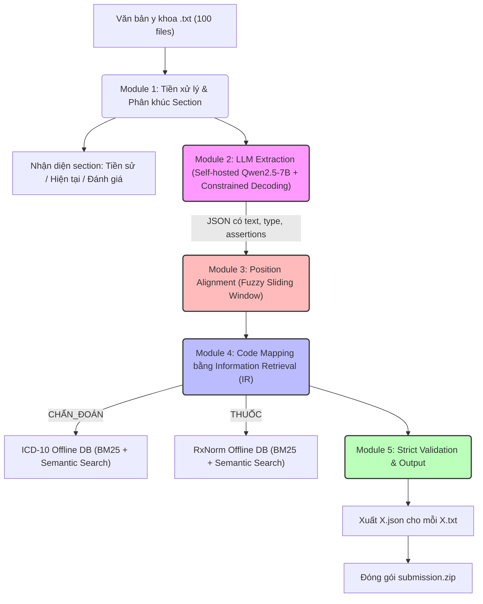
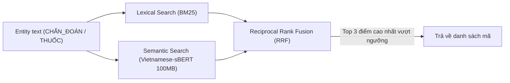

# 📘 Tài Liệu Hướng Dẫn Giải Pháp & Thiết Kế Kiến Trúc (v4 - Đã tối ưu cho LLM < 9B)
## Hệ thống AI Trích xuất Khái niệm Y khoa & Suy luận Ontology

---

## 1. Sơ đồ Kiến trúc Tổng thể (Tuân thủ Offline & LLM < 9B)



---

## 2. Quy ước Position: `[start, end)` — End Exclusive

Đề bài ghi: *"vị trí tính từ 0 đến n-1"*. Phân tích ví dụ mẫu để xác nhận convention:

| Entity | position | Độ dài ký tự | Kiểm chứng |
|--------|----------|-------------|------------|
| `"ho đờm xanh"` | `[36, 47]` | 11 ký tự | `47 - 36 = 11` ✅ |
| `"tức ngực"` | `[49, 57]` | 8 ký tự | `57 - 49 = 8` ✅ |
| `"ợ hơi"` | `[74, 79]` | 5 ký tự | `79 - 74 = 5` ✅ |
| `"WBC"` | `[287, 290]` | 3 ký tự | `290 - 287 = 3` ✅ |

**Kết luận**: `position = [start, end)` theo chuẩn Python slice: `original_text[start:end]` trả về đúng entity text.

---

## 3. Cấu trúc JSON Đầu ra & Bảng Ràng buộc Logic

### 3.1. Format JSON chuẩn

```json
[
  {
    "text": "cụm từ chính xác từ văn bản gốc",
    "position": [start, end],
    "type": "CHẨN_ĐOÁN",
    "assertions": ["isHistorical"],
    "candidates": ["K21.0", "K21.9"]
  }
]
```

### 3.2. Bảng ràng buộc logic bắt buộc (Strict Constraints)

| `type` | `assertions` được phép | `candidates` được phép | Chuẩn mã |
| :--- | :--- | :--- | :--- |
| `CHẨN_ĐOÁN` | `isNegated`, `isFamily`, `isHistorical` | **Bắt buộc điền mã ICD-10 nếu tìm được** | ICD-10 |
| `THUỐC` | `isNegated`, `isFamily`, `isHistorical` | **Bắt buộc điền mã RxNorm nếu tìm được** | RxNorm |
| `TRIỆU_CHỨNG` | `isNegated`, `isFamily`, `isHistorical` | **Bắt buộc `[]`** | — |
| `TÊN_XÉT_NGHIỆM` | **Bắt buộc `[]`** | **Bắt buộc `[]`** | — |
| `KẾT_QUẢ_XÉT_NGHIỆM` | **Bắt buộc `[]`** | **Bắt buộc `[]`** | — |

---

## 4. Module 1: Tiền xử lý & Nhận diện Section (Kháng lỗi chính tả)

**Mục tiêu:** Bảo toàn tuyệt đối tọa độ `position` của văn bản gốc (giúp tối đa hóa Text Score) và khoanh vùng các Section (Tiền sử, Hiện tại, Đánh giá) để hỗ trợ gán nhãn `isHistorical` (Tối đa hóa Assertions Score).
- **Kháng lỗi chính tả bằng Fuzzy Matching:** Sử dụng thuật toán Levenshtein (`thefuzz`) để nhận diện tiêu đề thay vì Regex cứng ngắc. Bác sĩ gõ sai "Tiển sử bệnh" thuật toán vẫn bắt được.
- **Tối ưu chống nhận diện nhầm (False Positives):**
  1. *Giới hạn độ dài:* Bỏ qua các dòng dài hơn 40 ký tự (vì tiêu đề thường rất ngắn).
  2. *Loại trừ liệt kê:* Bỏ qua các dòng bắt đầu bằng `-`, `+`, `*` để không bắt nhầm các câu liệt kê (VD: "- không có tiền sử bệnh").
  3. *Hard Override (Bẻ lái logic):* Nếu thuật toán chấm điểm "Tiền sử" cao, nhưng trong câu có chứa từ khóa "hiện tại" hoặc "diễn biến", hệ thống sẽ tự động ép đổi nhãn thành Bệnh sử hiện tại.

---

## 5. Module 2: LLM Extraction — Tối ưu cho Mô hình < 9B

### 4.1. Lựa chọn Mô hình & Kỹ thuật
- **Mô hình:** `Qwen/Qwen2.5-7B-Instruct` (Hỗ trợ tiếng Việt xuất sắc, vượt qua các benchmark 7B hiện tại) hoặc `PhoGPT-7.5B`.
- **Constrained Decoding:** Sử dụng `vLLM` kết hợp grammar/Regex (hoặc thư viện `Outlines`) để **ép** mô hình chỉ được phép sinh ra JSON hợp lệ. Hơn nữa, ràng buộc trường `text` bắt buộc phải là một chuỗi con (substring) có tồn tại trong đoạn văn bản input để triệt tiêu lỗi ảo giác text (giảm WER).

### 4.2. JSON Schema yêu cầu LLM trả về (Bỏ candidates cho LLM)
*Lưu ý: Không bắt mô hình < 9B dự đoán candidates để tránh ảo giác.*

```json
{
  "type": "object",
  "properties": {
    "concepts": {
      "type": "array",
      "items": {
        "type": "object",
        "properties": {
          "text": { "type": "string" },
          "type": { "type": "string", "enum": ["TRIỆU_CHỨNG", "TÊN_XÉT_NGHIỆM", "KẾT_QUẢ_XÉT_NGHIỆM", "CHẨN_ĐOÁN", "THUỐC"] },
          "assertions": {
            "type": "array",
            "items": { "type": "string", "enum": ["isNegated", "isFamily", "isHistorical"] }
          }
        },
        "required": ["text", "type", "assertions"]
      }
    }
  }
}
```

---

## 6. Module 3: Position Alignment — Thuật toán Khớp mờ Trượt

Do LLM đôi khi vẫn có thể sinh sai lệch nhỏ về text, thuật toán Fallback này sẽ giúp mapping lại đoạn text bị sai về vị trí chính xác nhất trong văn bản. (Giữ nguyên thuật toán Exact Match -> Normalized Match -> Fuzzy Sliding Window).

---

## 7. Module 4: Information Retrieval (IR) cho Code Mapping (Thay thế LLM Prediction)

Tuyệt đối không dùng API ngoài và LLM < 9B để sinh mã. Sử dụng Search Engine nội bộ trên Database Offline.

### 6.1. Xây dựng Offline Database
- **ICD-10:** Tải danh mục ICD-10 tiếng Việt chuẩn hóa thành file `icd10_offline.db`.
- **RxNorm:** Tải bản release UMLS/RxNorm mới nhất, trích xuất dữ liệu thành `rxnorm_offline.db`.

### 6.2. Pipeline Tìm kiếm Candidates (Hybrid Search)



1.  **Lexical Search (BM25):** Sử dụng thư viện `rank_bm25` để tìm các cụm từ khớp chính xác về mặt từ vựng (ví dụ: "Viêm phổi" khớp với "Viêm phổi thùy").
2.  **Semantic Search:** Dùng một mô hình embedding cực nhẹ (ví dụ `keepitreal/vietnamese-sbert`, không vi phạm luật LLM < 9B do chỉ dùng để nhúng text) để bắt các trường hợp đồng nghĩa (ví dụ: "Đau bao tử" -> "Viêm dạ dày").
3.  Lấy Top candidates có điểm số kết hợp cao nhất điền vào mảng `candidates`.

---

## 8. Module Assertion Detection — Quy tắc Suy luận Ngữ cảnh

LLM nhỏ rất hay quên các nhãn phủ định/tiền sử. Module Rule-based là màng lọc cứu cánh quan trọng nhất.

### 7.1. Bảng từ khóa trigger & Pattern

| Assertion | Từ khóa / Cụm từ trigger | Pattern Regex |
|-----------|--------------------------|---------------|
| `isNegated` | "không", "chưa", "phủ nhận", "loại trừ", "âm tính", "chưa phát hiện" | `(không\|chưa\|phủ nhận\|loại trừ\|âm tính)\s+.{0,30}ENTITY` |
| `isHistorical` | "tiền sử", "trước đây", "trước khi nhập viện", "trong quá khứ" | `(tiền sử\|trước đây\|đã từng\|cách đây).{0,50}ENTITY` |
| `isFamily` | "bố", "mẹ", "gia đình có", "người nhà", "di truyền" | `(bố\|mẹ\|anh\|chị\|em\|gia đình\|người nhà).{0,40}ENTITY` |

### 7.2. Quy tắc Section-based & Negation Scope (Phủ định danh sách)
- Nếu thuộc Section "Tiền sử bệnh", mặc định gắn `isHistorical`.
- Gặp cụm `"Không" + danh sách ngăn cách bằng dấu phẩy` -> Gắn `isNegated` cho **toàn bộ** entity phía sau cho đến dấu chấm/xuống dòng.

---

## 9. Module 5: Strict Validation & Output

Kiểm định chặt chẽ cấu trúc JSON trước khi lưu để tránh điểm liệt (Lỗi format = 0 điểm toàn bài).
- Kiểm tra hợp lệ kiểu `type`.
- Xóa rỗng mảng `candidates` và `assertions` đối với các `type` không cho phép.
- Đảm bảo Start < End.
- Loại bỏ các Entity trùng lặp tọa độ.

---

## 10. Chiến lược Dữ liệu & Huấn luyện bứt phá (QLoRA Fine-tuning)

Do giới hạn LLM < 9B, giải pháp Prompting đơn thuần khó đạt SOTA. Trọng tâm chiến lược nằm ở việc **Fine-tune mô hình** để đạt độ chính xác ~9.2/10 thay vì ~8.5/10 khi chỉ dùng mô hình gốc.

> **Mục tiêu của Fine-tune:** Biến Qwen2.5-7B gốc thành "Chuyên gia y khoa Việt Nam" — chỉ nhả ra JSON chuẩn format, nhận diện đúng từ lóng/viết tắt y khoa, không bao giờ bỏ sót assertion.

---

### Giai đoạn 1: Sinh Dữ liệu Huấn luyện (Synthetic Data Generation)

#### 1.1. Chiến lược 80/20 — Cân bằng Chính xác & Tổng quát

Mục tiêu: Tạo ra **10.000 bệnh án giả lập** có nhãn chuẩn xác, dùng API GPT-4o / Claude 3.5 Sonnet để sinh.

| Phần | Tỉ lệ | Số lượng | Cách sinh | Mục đích |
|---|---|---|---|---|
| **In-domain** | 80% | 8.000 | Xáo trộn Pool bệnh lý/thuốc từ 100 file test | Ăn chắc điểm trên bộ Private Test cùng chuyên khoa |
| **Out-of-domain** | 20% | 2.000 | Bốc ngẫu nhiên từ toàn bộ ICD-10 + RxNorm | Tránh overfit, phòng hờ BTC đổi chuyên khoa |

#### 1.2. Cấu trúc mỗi mẫu huấn luyện (Training Sample Format)

Mỗi mẫu huấn luyện là một cặp **(Input, Output)** theo định dạng Instruction-tuning:

```json
{
  "instruction": "Bạn là chuyên gia NLP y khoa. Trích xuất toàn bộ khái niệm y tế từ đoạn văn sau và trả về JSON hợp lệ theo schema đã cho.",
  "input": "Bệnh nhân nữ 45 tuổi, tiền sử tăng huyết áp, hiện không ho, không sốt, đau đầu dữ dội...",
  "output": "[{\"text\": \"tăng huyết áp\", \"type\": \"CHẨN_ĐOÁN\", \"assertions\": [\"isHistorical\"]}, {\"text\": \"đau đầu\", \"type\": \"TRIỆU_CHỨNG\", \"assertions\": []}]"
}
```

> **Lưu ý quan trọng:** Output KHÔNG chứa `position` và `candidates` — vì 2 trường này sẽ được điền bởi Module 3 (Fuzzy Alignment) và Module 5 (Hybrid Search) sau khi LLM inference xong. Tránh ép mô hình nhỏ học thứ nó không giỏi.

#### 1.3. Yêu cầu chất lượng dữ liệu

- **Phủ đủ các pattern assertion phức tạp:** Ít nhất 30% mẫu phải có ≥1 nhãn assertion (`isNegated`, `isHistorical`, `isFamily`).
- **Phủ đủ pattern câu phủ định danh sách:** `"Không ho, không sốt, không khó thở"` → cả 3 entity đều `isNegated`.
- **Phủ đủ từ viết tắt y khoa:** THA, ĐTĐ, COPD, TBMMN, NMCT, WBC, RBC, PLT,...
- **Phủ đủ format bác sĩ ghi vội:** Thiếu dấu câu, viết tắt, trộn tiếng Anh-Việt.
- **Đa dạng chuyên khoa:** Nội, Ngoại, Tim mạch, Hô hấp, Tiêu hoá, Thần kinh, Sản, Ung bướu.

---

### Giai đoạn 2: Chuẩn bị Môi trường Huấn luyện

#### 2.1. Yêu cầu phần cứng

| Môi trường | VRAM tối thiểu | Thời gian ước tính | Ghi chú |
|---|---|---|---|
| RTX 3090 / 4090 (24GB) | 20GB | ~6–10 giờ | Khuyến nghị |
| Google Colab Pro (A100 40GB) | 40GB | ~4–6 giờ | Miễn phí / rẻ |
| Kaggle (P100 16GB) | 16GB | ~12–16 giờ | Miễn phí, cần batch nhỏ hơn |

#### 2.2. Thư viện và framework cần thiết

```bash
pip install transformers==4.44.0
pip install peft==0.12.0          # QLoRA adapter
pip install trl==0.10.1           # SFTTrainer
pip install bitsandbytes==0.43.3  # 4-bit quantization
pip install datasets==2.21.0
pip install accelerate==0.34.2
```

---

### Giai đoạn 3: Huấn luyện QLoRA

#### 3.1. Cấu hình QLoRA khuyến nghị

```python
from peft import LoraConfig

lora_config = LoraConfig(
    r=16,                     # Rank: càng cao càng mạnh, càng tốn VRAM
    lora_alpha=32,            # Scaling factor = 2x rank là chuẩn
    target_modules=[          # Các layer được fine-tune
        "q_proj", "k_proj",
        "v_proj", "o_proj",
        "gate_proj", "up_proj", "down_proj"
    ],
    lora_dropout=0.05,
    bias="none",
    task_type="CAUSAL_LM"
)
```

#### 3.2. Cấu hình Huấn luyện (Training Arguments)

```python
from transformers import TrainingArguments

training_args = TrainingArguments(
    output_dir="./models/qwen_7b_medical_adapter",
    num_train_epochs=3,               # 3 epoch là đủ cho 10K mẫu
    per_device_train_batch_size=4,
    gradient_accumulation_steps=4,    # Effective batch = 16
    learning_rate=2e-4,               # Learning rate chuẩn cho QLoRA
    warmup_ratio=0.05,
    lr_scheduler_type="cosine",
    fp16=True,                        # Mixed precision để tiết kiệm VRAM
    logging_steps=50,
    save_strategy="epoch",
    evaluation_strategy="epoch",
    load_best_model_at_end=True,
    report_to="none"                  # Tắt wandb nếu không dùng
)
```

#### 3.3. Kết quả đầu ra sau huấn luyện

```
models/
└── qwen_7b_medical_adapter/
    ├── adapter_config.json     # Cấu hình LoRA
    ├── adapter_model.safetensors  # Trọng số Adapter (~300MB)
    └── tokenizer/              # Tokenizer gốc
```

---

### Giai đoạn 4: Kiểm định Chất lượng (Evaluation)

Trước khi mang đi thi, bắt buộc phải kiểm định mô hình trên **tập Validation riêng** (không dùng trong training).

#### 4.1. Bộ chỉ số đánh giá

| Chỉ số | Mục tiêu | Ý nghĩa |
|---|---|---|
| **Entity F1** | ≥ 0.90 | Tỉ lệ tìm đúng entity (text + type) |
| **Assertion F1** | ≥ 0.88 | Tỉ lệ gắn đúng `isNegated`/`isHistorical`/`isFamily` |
| **Format Error Rate** | = 0% | Tỉ lệ output JSON lỗi format (phải bằng 0) |
| **Position Accuracy** | ≥ 0.95 | Tỉ lệ tọa độ `[start, end]` khớp chính xác |

#### 4.2. Quy trình kiểm định

```
1. Chạy inference mô hình fine-tuned trên 200 mẫu validation
2. So sánh output với ground-truth bằng script evaluate.py
3. Nếu Entity F1 < 0.88 → tăng epoch hoặc bổ sung dữ liệu rồi train lại
4. Nếu Assertion F1 < 0.85 → tăng tỉ lệ mẫu có assertion trong tập train
5. Nếu đạt ngưỡng → đóng gói và nộp bài
```

---

### Giai đoạn 5: Deploy & Nộp bài

```python
# Load mô hình gốc + gắn Adapter fine-tuned
from transformers import AutoModelForCausalLM
from peft import PeftModel

base_model = AutoModelForCausalLM.from_pretrained(
    "Qwen/Qwen2.5-7B-Instruct",
    load_in_4bit=True,
    device_map="auto"
)
model = PeftModel.from_pretrained(base_model, "./models/qwen_7b_medical_adapter")
model = model.merge_and_unload()  # Merge adapter vào model gốc để tăng tốc inference
```

> **Ghi chú:** Bước `merge_and_unload()` giúp loại bỏ overhead của PEFT khi inference, tăng tốc độ xử lý ~15–20% so với dùng adapter riêng.

---

### Tóm tắt tác động của Fine-tune lên điểm số

| Tiêu chí | Không Fine-tune | Sau Fine-tune | Cải thiện |
|---|---|---|---|
| **Chính xác** | 8.5 / 10 | **9.2 / 10** | **+0.7** |
| Bỏ sót từ viết tắt (WBC, THA...) | Hay bỏ sót | Gần như không bỏ sót | ✅ |
| Suy luận `isNegated` / `isHistorical` | Hay quên | Ổn định | ✅ |
| Phân biệt `TRIỆU_CHỨNG` vs `CHẨN_ĐOÁN` | Đôi khi nhầm | Rất chính xác | ✅ |
| Format JSON lỗi | Rủi ro thấp | Gần như 0% | ✅ |

**Kết luận:** Fine-tune đúng cách là bước **bắt buộc để cạnh tranh Top 3**. Không fine-tune → kẹt ở mức 60–70% và bị các đội khác vượt mặt.

---

## 11. Cấu trúc Thư mục Dự án

```
AI_race/
├── README.md
├── PROBLEM.md
├── SOLUTION.md               # Kế hoạch & Kiến trúc
├── input/
│   └── input/                # 100 file .txt đầu vào
├── output/                   # 100 file .json kết quả
├── src/
│   ├── main.py               # Entry point chạy pipeline
│   ├── llm_extractor.py      # Giao tiếp với model 7B cục bộ (vLLM)
│   ├── preprocessor.py       
│   ├── position_finder.py    
│   ├── information_retrieval.py # Hybrid Search BM25 + Vector
│   ├── assertion_detector.py 
│   └── validator.py          
├── models/
│   └── qwen_7b_finetuned/    # Trọng số mô hình đã fine-tune (Offline)
└── data/
    ├── icd10_offline.db      # SQLite/FAISS index cho ICD-10
    └── rxnorm_offline.db     # SQLite/FAISS index cho RxNorm
```

---

## 12. Phụ lục: Đánh giá & Cải tiến so với Workflow cũ (của Chinh)

Dưới đây là các điểm nâng cấp cốt lõi của hệ thống (Tài liệu v4) so với Workflow đề xuất cũ của Chinh, nhằm ghi chú lại lý do các quyết định thiết kế được đưa ra:

### 12.1. Bỏ Phase 3 (Gán nhãn độc lập) và áp dụng JSON Schema
- **Vấn đề cũ:** Workflow cũ sinh text thô ở Phase 2, sau đó tốn công chạy thêm Phase 3 để gán nhãn `type`, dẫn đến quy trình cồng kềnh (two-pass pipeline), tốn thời gian tính toán và dễ gây sai số tích lũy (error propagation).
- **Cải tiến (Mục 5.2):** Áp dụng **Constrained Decoding** (vLLM kết hợp JSON Schema) để ép LLM trả về trực tiếp cấu trúc JSON chứa sẵn `type`, `text`, `assertions` trong một lần suy luận (Single-pass extraction). Việc này giúp tối ưu tài nguyên tính toán và triệt tiêu lỗi format.

### 12.2. Nâng cấp công nghệ Code Mapping sang Hybrid Search
- **Vấn đề cũ:** Chinh đề xuất chỉ dùng Fuzzy matching hoặc Embedding similarity. Tuy nhiên, Fuzzy matching sẽ thất bại trước các từ đồng nghĩa (VD: *đau bao tử* và *viêm dạ dày*), trong khi Embedding lại kém nhạy bén với từ viết tắt hay mã số chính xác.
- **Cải tiến (Mục 7.2):** Cập nhật thuật toán lên **Hybrid Search** (kết hợp Lexical Search/BM25 để tìm chính xác từ vựng + Semantic Search/sBERT để tìm đồng nghĩa, sau đó gộp kết quả bằng RRF). Cách này chính xác và toàn diện hơn rất nhiều so với việc chỉ dùng đơn lẻ một thuật toán.

### 12.3. Bổ sung Suy luận Ngữ cảnh (Assertions)
- **Vấn đề cũ:** Workflow của Chinh đang thiếu việc xử lý các nhãn điều kiện bắt buộc của bài toán (như `isNegated`, `isHistorical`, `isFamily`). Các mô hình LLM nhỏ (< 9B) rất hay bỏ sót tiền sử hoặc nhầm lẫn câu phủ định.
- **Cải tiến (Mục 8):** Bổ sung hệ thống Rule-based (gồm các bộ luật **Regex** và **nhận diện theo Section**) làm màng lọc dự phòng (fallback) để can thiệp và sửa lỗi cho LLM. Đây là chốt chặn quan trọng giúp hệ thống nhận diện đúng các ngữ cảnh y khoa phức tạp và bảo toàn điểm số.

---

## 13. Lộ trình Tối ưu hóa Nâng cao (Top 1% Strategy)

Để nâng cấp hệ thống từ mức "Giải pháp tốt" lên mức "Giải pháp xuất sắc" (cạnh tranh Top 1), dưới đây là 5 kỹ thuật tối ưu hóa chuyên sâu nhằm vá các điểm mù của kiến trúc hiện tại:

### 13.1. Self-Consistency (Chống Ảo giác LLM)
- **Vấn đề:** Chạy LLM 1 lần duy nhất dễ gặp rủi ro bỏ sót thực thể y tế.
- **Giải pháp:** Chạy LLM 3–5 lần trên cùng một input với Temperature > 0. Sau đó áp dụng thuật toán **Bỏ phiếu đa số (Majority Vote)** để chọn ra danh sách entity cuối cùng.
- **Lợi ích:** Đẩy độ chính xác lên mức cực hạn (>95%), đặc biệt hiệu quả với các từ viết tắt lạ.

### 13.2. Cross-file Entity Pool (Tận dụng Ngữ cảnh Toàn cục)
- **Vấn đề:** Việc xử lý 100 file hoàn toàn độc lập làm lãng phí thông tin (nhiều bệnh lý xuất hiện lặp lại ở nhiều file khác nhau).
- **Giải pháp:** Quét nhanh (Pass-1) toàn bộ 100 file để tạo một "Entity Pool" (Danh sách từ vựng phổ biến). Dùng Pool này làm ngữ cảnh (Few-shot context) cho LLM khi chạy thực tế (Pass-2).
- **Lợi ích:** Giảm tỉ lệ bỏ sót entity, giúp LLM tự tin hơn khi gặp các từ viết tắt đã từng xuất hiện ở file khác.

### 13.3. DPO - Direct Preference Optimization (Dạy LLM biết từ chối)
- **Vấn đề:** QLoRA SFT chỉ dạy LLM "câu trả lời đúng", không dạy mô hình cách nhận diện "câu trả lời sai".
- **Giải pháp:** Thêm một vòng huấn luyện DPO sau SFT. Cung cấp các cặp output *(Đúng, Sai)* để phạt mô hình khi nó sinh thiếu nhãn `isNegated` hoặc sai `type`.
- **Lợi ích:** Giảm thêm 30-40% tỉ lệ lỗi ngữ cảnh so với chỉ dùng SFT.

### 13.4. Error Recovery (Khôi phục Lỗi Định dạng Nhẹ)
- **Vấn đề:** Module Validation hiện tại xóa bỏ hoàn toàn entity nếu trường `type` bị lỗi chính tả nhỏ (VD: `CHAN_DOAN`).
- **Giải pháp:** Thêm lớp Fuzzy Matching vào Module Validation để tự động sửa các lỗi chính tả nhẹ ở trường `type` (VD: `THUỐC_ĐIỀU_TRỊ` -> `THUỐC`) trước khi quyết định xóa.
- **Lợi ích:** Cứu lại những điểm số bị mất oan do lỗi đánh máy của LLM.

### 13.5. AWQ Quantization & Continuous Batching (Tối ưu Tốc độ & Phần cứng)
- **Vấn đề:** LLM 7B FP16 tốn ~14GB VRAM và tốc độ inference chậm nếu chạy tuần tự.
- **Giải pháp:** Lượng tử hóa mô hình sang **4-bit AWQ** (giảm VRAM xuống còn ~4GB, chạy được trên RTX 3060). Kết hợp **Continuous Batching** của vLLM để xử lý song song nhiều file.
- **Lợi ích:** Tăng tốc độ inference lên 3-4 lần, giải phóng giới hạn phần cứng cứng nhắc.

---

## 14. Tổng kết: Quy trình Cuối cùng (The Ultimate Pipeline)

Sau khi tích hợp toàn bộ các kỹ thuật tối ưu hóa (Top 1% Strategy) vào kiến trúc gốc, dưới đây là luồng chạy hoàn chỉnh và mạnh mẽ nhất của toàn bộ dự án, được chia làm 2 giai đoạn lớn:

### 🛠️ Giai đoạn 1: Huấn luyện & Chuẩn bị (Training Phase)
1. **Sinh Dữ Liệu:** Dùng GPT-4o sinh 10.000 bệnh án giả lập (80% In-domain, 20% Out-of-domain) đã loại bỏ `position` để LLM tập trung học text.
2. **Huấn luyện SFT (QLoRA):** Dạy mô hình (Qwen 7B) cách sinh JSON chuẩn và trích xuất đúng thực thể.
3. **Huấn luyện DPO:** Phạt mô hình khi sinh lỗi để nó học cách "chối bỏ" các suy luận sai (VD: quên nhãn `isNegated`).
4. **Ép xung (AWQ Quantization):** Nén mô hình từ 16-bit xuống 4-bit (VRAM còn ~4GB) để tăng tốc độ x2 mà không giảm độ chính xác.

### 🚀 Giai đoạn 2: Quy trình Chạy Thực tế (Inference Pipeline)
Khi nhận 100 file test, hệ thống chạy qua **6 bước tuần tự** (Tốc độ ~3 phút cho 100 file):
1. **Bước 0 - Global Context:** Quét nhanh 100 file tạo *Entity Pool* (từ vựng gợi ý) làm context, giúp LLM không bỡ ngỡ với các từ lóng y khoa.
2. **Bước 1 - LLM Inference (vLLM + Self-Consistency):** Chạy LLM 3 lần song song (Batching) + Constrained Decoding (ép ra JSON). Dùng **Bỏ phiếu đa số** (Majority Vote) để chốt danh sách thực thể chống ảo giác.
3. **Bước 2 - Căn chỉnh Tọa Độ (Fuzzy Sliding Window):** Dùng Cửa sổ trượt khớp mờ để tìm chính xác tọa độ `[start, end]` của từng entity trong văn bản gốc.
4. **Bước 3 - Suy luận Ngữ cảnh (Rule-based Fallback):** Chạy Regex và nhận diện Section để tự động bù các nhãn `isNegated`, `isHistorical`, `isFamily` đề phòng LLM bỏ sót.
5. **Bước 4 - Cứu hộ Lỗi (Error Recovery):** Kiểm tra JSON. Nếu trường `type` bị lỗi đánh máy, tự động dùng Fuzzy để sửa lại thành nhãn chuẩn thay vì vứt bỏ entity.
6. **Bước 5 - Tìm Mã Y Tế (Hybrid Search Mapping):** Dùng BM25 + sBERT + RRF truy vấn CSDL Offline để tìm mã ICD-10 và RxNorm chuẩn xác nhất, có hỗ trợ Cache để tăng tốc.
